* ここではprocessing、及びopenframeworksによるアート作品を公開しています。以下にプレビューを掲載しており、名前をクリックすればコードが閲覧できます。

* [circle_menbo](https://github.com/gotutiyan/art-by-processing/tree/master/circle_menbo)

  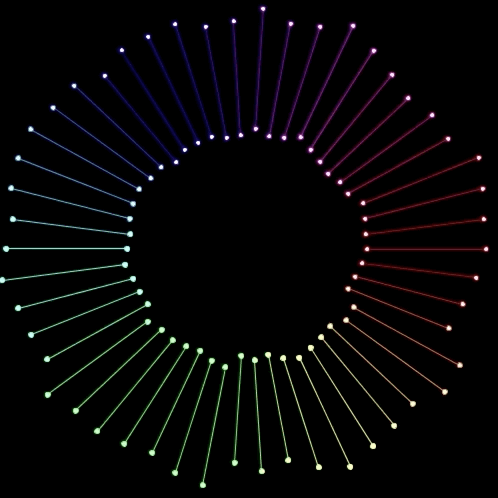

* [circle_polygon](https://github.com/gotutiyan/art-by-processing/tree/master/circle_polygon)

  

* [color_line](https://github.com/gotutiyan/art-by-processing/tree/master/color_line)

  

* [cube_factory](https://github.com/gotutiyan/art-by-processing/tree/master/cube_factory)

  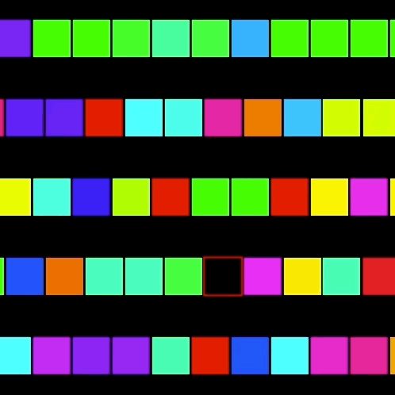

* [cyber_asteroid](https://github.com/gotutiyan/art-by-processing/tree/master/cyber_asteroid)

  

* [cyber_circle](https://github.com/gotutiyan/art-by-processing/tree/master/cyber_circle)

  

* [flare](https://github.com/gotutiyan/art-by-processing/tree/master/flare)

  

* [link_circle](https://github.com/gotutiyan/art-by-processing/tree/master/link_circle)

  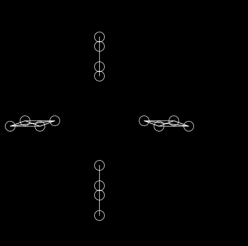

* [many_sin](https://github.com/gotutiyan/art-by-processing/tree/master/many_sin)

  

* [moving_tile](https://github.com/gotutiyan/art-by-processing/tree/master/moving_tile)

  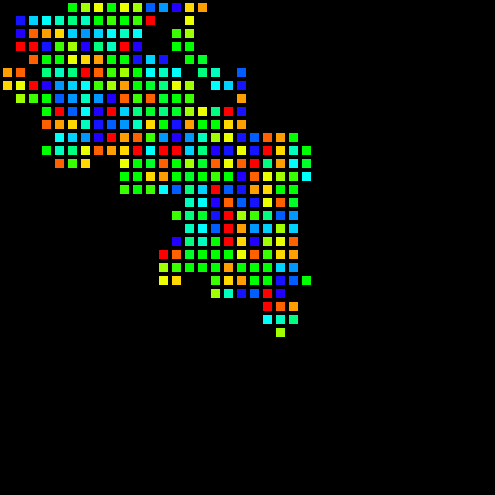

* [natto](https://github.com/gotutiyan/art-by-processing/tree/master/natto)

  ​	

* [random_line](https://github.com/gotutiyan/art-by-processing/tree/master/random_line)

  

* [randomwalk](https://github.com/gotutiyan/art-by-processing/tree/master/randomwalk)

  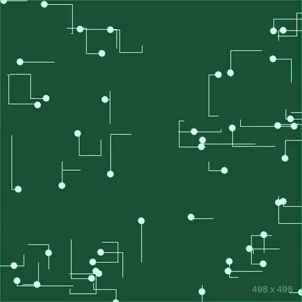

* [randomwalk2](https://github.com/gotutiyan/art-by-processing/tree/master/randomwalk2)

  

* [four_arc](https://github.com/gotutiyan/art-by-processing/tree/master/four_arc)

  

* [rect_split](https://github.com/gotutiyan/art-by-processing/tree/master/rect_split)

  

* [Loading](https://github.com/gotutiyan/art-by-processing/tree/master/Loading)

  
  
* [mirror_bound](https://github.com/gotutiyan/art-by-processing/tree/master/mirror_bound)

  

* [explosion_planet](https://github.com/gotutiyan/art-by-processing/tree/master/explosion_planet)
  
  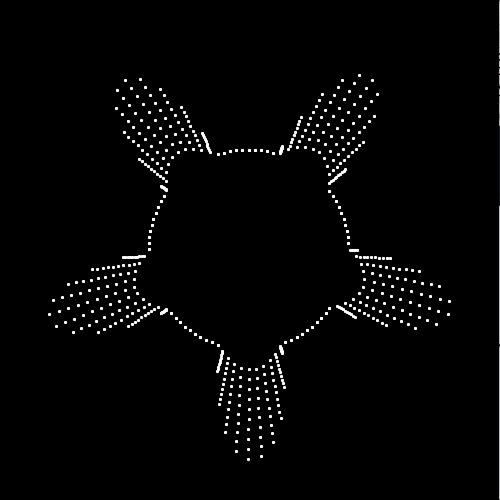

* [constrain_sin](https://github.com/gotutiyan/art-by-processing/tree/master/constrain_sin)

  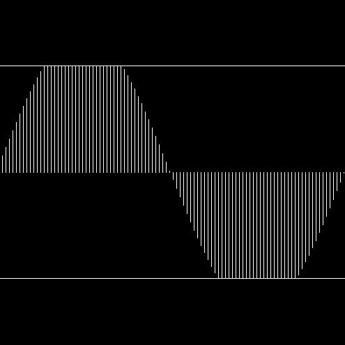

* [fill_noisy](https://github.com/gotutiyan/art-by-processing/tree/master/fill_noisy)

  

* [strange_cell](https://github.com/gotutiyan/art-by-processing/tree/master/strange_cell)

  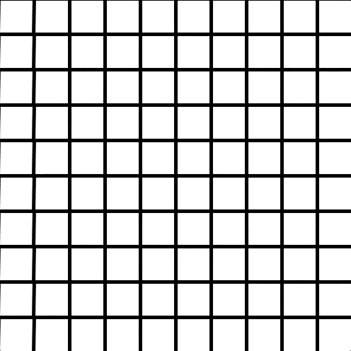

* [swap_triangle](https://github.com/gotutiyan/art-by-processing/tree/master/swap_triangle)

  

* [hidden_flower](https://github.com/gotutiyan/art-by-processing/tree/master/hidden_flower)

  

* [takoyaki](https://github.com/gotutiyan/generative-art-Processing/tree/master/takoyaki)

  

* [cross_or_square](https://github.com/gotutiyan/generative-art-Processing/tree/master/cross_or_square)

  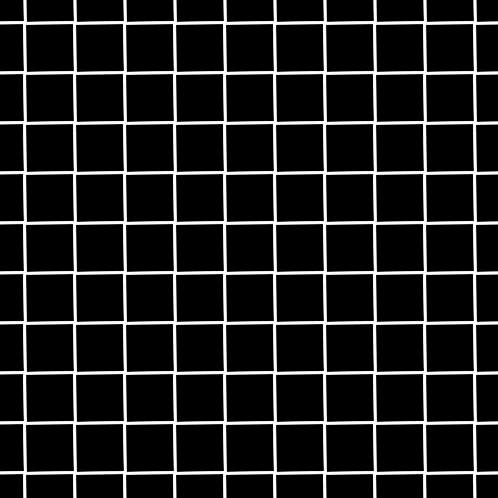

* [morphing_demo](https://github.com/gotutiyan/generative-art-Processing/tree/master/morphing_demo)

  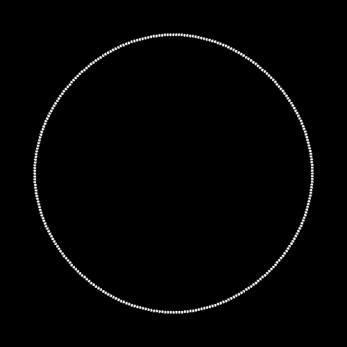

* [circeroid](https://github.com/gotutiyan/generative-art-Processing/tree/master/circeroid)

  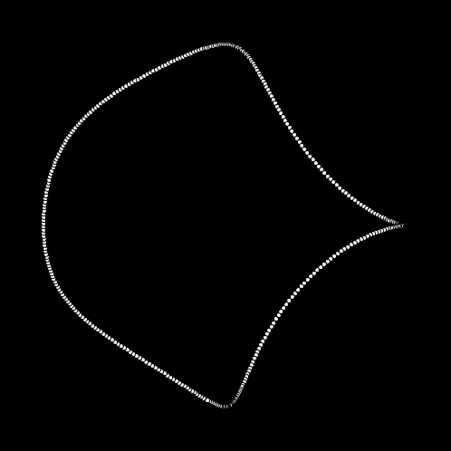

* [twin_cloth](https://github.com/gotutiyan/generative-art-Processing/tree/master/twin_cloth)

  

* [colorful_donut](https://github.com/gotutiyan/generative-art-Processing/tree/master/colorful_donut)

  

* [strong_wind](https://github.com/gotutiyan/generative-art-Processing/tree/master/strong_wind)

  

* [circeroid2](https://github.com/gotutiyan/generative-art-Processing/tree/master/circeroid2)

  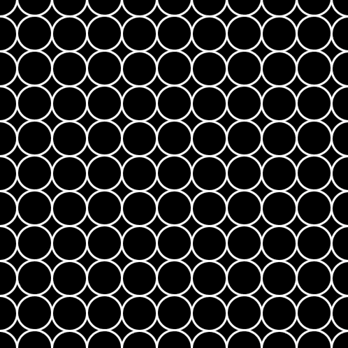

* [arcs](https://github.com/gotutiyan/generative-art-Processing/tree/master/arcs)

  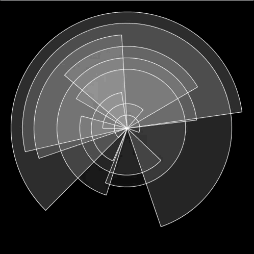

* [lifeline](https://github.com/gotutiyan/generative-art-Processing/tree/master/lifeline)

  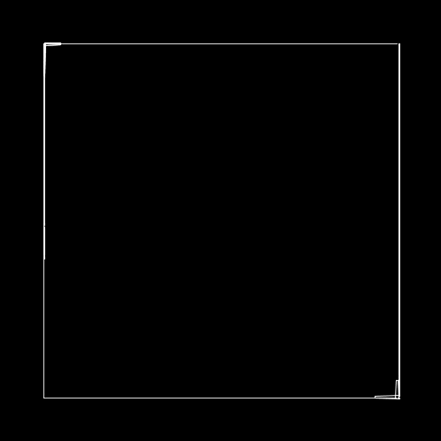

* [rettousei](https://github.com/gotutiyan/generative-art-Processing/tree/master/rettousei)

  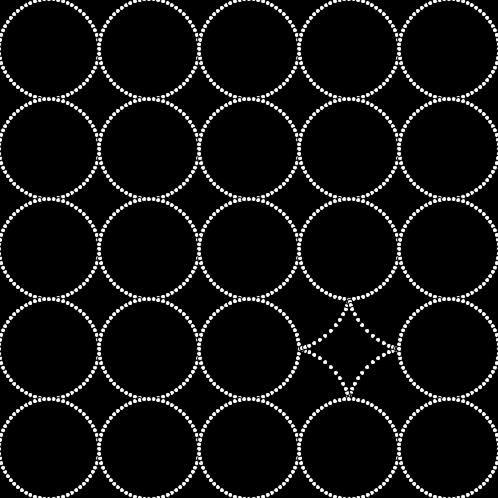

* [stars](https://github.com/gotutiyan/generative-art-Processing/tree/master/stars)

  

* [swap_square](https://github.com/gotutiyan/generative-art-Processing/tree/master/swap_square)

  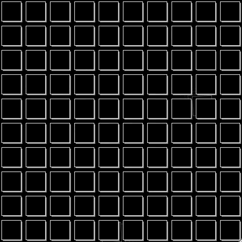

* [rec_rect](https://github.com/gotutiyan/generative-art-Processing/tree/master/rec_rect)

  

* [noised_circles](https://github.com/gotutiyan/generative-art-Processing/tree/master/noised_circles)

  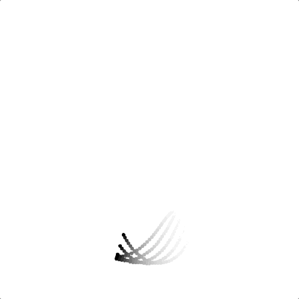
